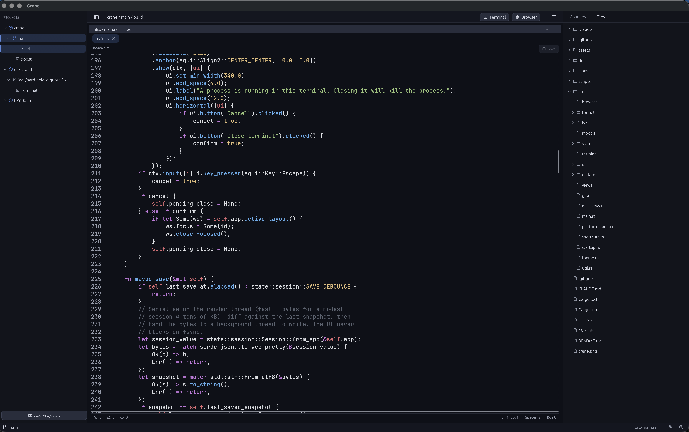
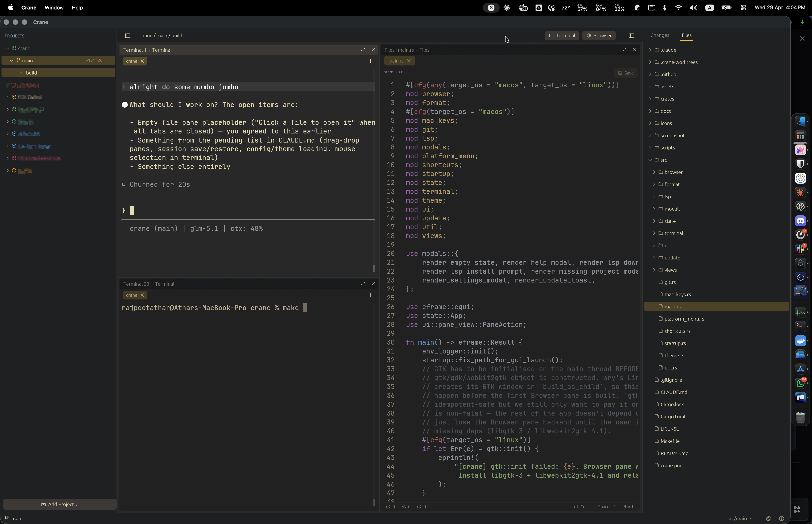

# Crane

<p align="center">


</p>

Native, GPU-rendered desktop development environment for orchestrating terminals, file browsing, diffs, and git workflows across isolated git workspaces.

Built in pure Rust on [egui](https://github.com/emilk/egui) + [wgpu](https://github.com/gfx-rs/wgpu), with an in-house terminal core (`crates/crane_term`) wrapping [vte](https://github.com/alacritty/vte) for VT parsing and [portable-pty](https://github.com/wez/wezterm/tree/main/pty) for cross-platform PTY.

---

## Download

Grab the latest build for your platform from the [Releases](https://github.com/rajpootathar/Crane/releases) page.

- **macOS** (Apple Silicon + Intel, universal) — `Crane-<version>-universal.dmg`
  - Double-click to mount, drag **Crane.app** into `/Applications`.
  - First launch: right-click the app → **Open** (ad-hoc signed, macOS asks once).
  - If macOS says **"Crane is damaged and can't be opened"**, strip the download-quarantine bit:
    ```bash
    xattr -dr com.apple.quarantine /Applications/Crane.app
    ```
    Then open normally. (This happens on unsigned/unnotarized builds; a paid Apple Developer ID would fix it at the source.)
- **Linux** (x86_64, Debian/Ubuntu) — `crane_<version>_amd64.deb`
  - `sudo dpkg -i crane_<version>_amd64.deb`
- **Windows** (x86_64) — `Crane-<version>-windows-x86_64.zip`
  - Extract, run `crane.exe`.

---

## Features

### Workspaces & projects
- **Project → Workspace → Tab → Layout → Pane** hierarchy. Each Workspace is a git worktree (`git worktree add`) so branches are real filesystem checkouts, not virtual switches.
- **Drag-drop reorder** for projects, workspaces, and tabs in the Left Panel.
- **Loose-files projects** — folders that aren't a git repo surface their contents as a flat tree; nested `.git` roots auto-promote to sub-projects under a group header.
- **Session restore** — projects, workspaces, tabs, layout splits, open files, panel widths, fonts, themes, ANSI/SGR terminal state all persist to `~/.crane/session.json` and reload exactly as left.
- **Workspace lifecycle** — Cmd+Q confirmation, ghost-worktree pruning when the dir disappears outside Crane.

### Panes
- **Split panes** with draggable dividers; horizontal / vertical splits via `Cmd+D` / `Cmd+Shift+D`. Focus border highlights the active pane.
- **Pane types:**
  - **Terminal** — in-house VT parser (`crates/crane_term`) on top of `portable-pty`. Owns its own grid, scrollback, `?2026` synchronized-output replay, resize-aware reflow, wrap-aware copy, reverse-wraparound for `\b` / `CSI D`.
  - **Files** — editable tabbed editor with `syntect` highlighting (line-incremental cache so typing in a large file stays smooth), find/replace, read-only mode for files outside any workspace, native trash on delete, undo stack for file ops.
  - **Diff** — unified diff with hunk-level stage button, per-hunk jump nav, minimap scrollbar, syntax highlighting on both sides. Computation cached via `JobSystem` — re-rendering a 5k-line diff is a single `Arc::clone`.
  - **Markdown** — `pulldown-cmark` render with composite paragraphs (no inter-segment gaps), accent-tinted headings, code-fence styling.
  - **Browser** — `wry`-backed embedded webview (macOS / Linux / Windows).
  - **PDF** — `pdfium-render` viewer with text selection, page navigation, "Open Externally" handoff.

### Git
- **Right Panel Changes** — staged / unstaged split, stage/unstage by file or hunk, commit (Cmd+Enter), push, pull, fetch.
- **Git Log Pane** (`Cmd+9`) — DAG graph with lane-based layout, ref pills (HEAD / local branch / remote / tag), filter by subject/hash/author + by branch + by user, right-click menu (checkout / branch from / worktree from / cherry-pick / revert / copy hash), auto-refresh on `.git/refs/` changes via filesystem watcher.
- **Branch picker** — click the branch chip in the status bar to switch / pick branches across all repos in the active workspace.
- **External edits land instantly** — any file touched outside Crane (other editor, build script, sub-agent in a terminal pane) reflects in the Changes tab within ~50 ms.

### Performance & architecture
- **No async runtime** — plain `std::thread` + `parking_lot` + `mpsc`. No Tokio.
- **JobSystem** (`src/jobs/`) — bounded worker pools (4 CPU + 2 I/O), keyed jobs with dedup-on-supersede (newer submit cancels older), cooperative cancellation tokens, `OnceLock` global accessor for render-side use. Idle Crane runs zero git subprocesses; only real changes wake the system.
- **FileWatcher** (`src/file_watcher.rs`) — one `notify` watcher + one debouncer thread for the whole app, 50 ms event coalescing, prefix routing to ProjectId, filters `.git/objects/`, `.git/logs/`, editor temp files. macOS FSEvents, Linux inotify, Windows ReadDirectoryChangesW.
- **DirCache** (`src/dir_cache.rs`) — mtime-keyed `read_dir` cache; the Files Pane tree reads from `Arc<Vec<DirEntryCached>>` on hit (zero allocation, zero `read_dir`).
- **Cached diff renders** — `TextDiff::from_lines` + `git diff` subprocess run on the I/O pool; `Arc<DiffComputed>` cached on the tab and invalidated explicitly on content change.
- **Cached PTY repaint** — terminal reader thread gates `request_repaint()` on a dirty-epoch + cursor-position change.
- **Panic-safe workers** — a job that panics doesn't take down the worker; the registry entry is released, the consumer sees `Disconnected`, the pool keeps running.
- **Lazy init** — sessions that never open a project pay zero thread cost.

### Fonts, themes, accessibility
- **System font fallback chain** — CJK / Arabic / Hebrew / Devanagari registered at startup so non-Latin scripts render correctly.
- **Live theme switcher** — `crane.yaml`-driven palettes with built-in dark / light themes; reloads on save.
- **Font size** — `Cmd+=` / `Cmd+-` / `Cmd+0`. Per-pane scaling.
- **Confirm-before-quit** — Cmd+Q prompts; prevents accidental dismissal.

## Keyboard shortcuts

| Key | Action |
|---|---|
| `Cmd+T` | Split active Pane with a new terminal |
| `Cmd+Shift+T` | New Tab in active Workspace |
| `Cmd+D` / `Cmd+Shift+D` | Split horizontally / vertically |
| `Cmd+W` | Close focused Pane |
| `Cmd+Shift+W` | Close active Tab |
| `Cmd+[` / `Cmd+]` | Focus prev / next Pane |
| `Cmd+\`` / `Cmd+~` | Tab switcher (forward / backward) |
| `Cmd+B` / `Cmd+/` | Toggle Left / Right Panel |
| `Cmd+9` | Toggle Git Log Pane on active Tab |
| `Cmd+O` / `Cmd+Shift+O` | Open file / open folder as project |
| `Cmd+F` | Find in active editor — or focus the Git Log filter when that pane has focus |
| `Cmd+H` | Toggle find-and-replace in active editor |
| `Cmd+=` / `Cmd+-` / `Cmd+0` | Font size up / down / reset |
| `Cmd+S` | Save the active file in Files Pane |
| `Cmd+Enter` | Submit commit (when the commit message field is focused) |
| `Cmd+Q` | Quit (with confirmation modal) |

---

## Build from source

Requires **Rust 1.94+** and platform-specific system dependencies.

```bash
git clone https://github.com/rajpootathar/Crane.git
cd Crane
cargo run --release
```

### macOS

- No extra system deps. macOS 11+ recommended.

### Linux

```bash
sudo apt install \
  libxkbcommon-dev libwayland-dev libgl-dev libx11-dev \
  libxcb1-dev libxrandr-dev libxi-dev libxcursor-dev pkg-config
```

### Windows

Needs the MSVC toolchain (via Visual Studio Build Tools). No other prerequisites.

---

## Packaging

The `Makefile` wraps `cargo-bundle` + `hdiutil`. Run from the repo root:

```bash
make help                # list targets
make bundle              # build .app for the host arch
make dmg                 # bundle + .dmg
make release             # == dmg
make bundle-universal    # arm64 + x86_64 → universal .app
make dmg-universal       # universal .app → .dmg
make release-universal   # == dmg-universal
make upload TAG=v0.1.0   # create a GitHub release and attach the DMG
make clean               # remove bundles / DMGs
```

Output paths:
- `target/release/bundle/osx/Crane.app`
- `target/release/Crane-<version>-<arch>.dmg`
- `target/release/Crane-<version>-universal.dmg`

`make icns` regenerates `icons/crane.icns` from `crane.png` using `sips` + `iconutil`.

## Automated releases

Pushing a tag `vX.Y.Z` triggers [`.github/workflows/release.yml`](.github/workflows/release.yml), which builds on macOS / Linux / Windows runners and attaches:

- `Crane-<version>-universal.dmg`
- `crane_<version>_amd64.deb`
- `Crane-<version>-windows-x86_64.zip`

…to the GitHub Release for that tag.

```bash
git tag v0.1.0
git push origin v0.1.0
```

---

## Architecture

Single binary. Pure Rust. No Electron, no web runtime, no FFI, no async runtime.

```
src/
├── main.rs          eframe entry + shortcuts + on_exit shutdown
├── state/
│   ├── state.rs     App · Project · Workspace · Tab
│   ├── layout.rs    Layout tree (Node::Leaf / Node::Split) · Pane · PaneContent
│   └── session.rs   Session save/restore (~/.crane/session.json)
├── terminal/        PTY spawn + crane_term::Term wiring + reader thread + grid renderer
├── (crates/crane_term)   In-house VT parser + grid + scrollback + reflow
├── jobs/            Bounded worker pools · keyed dedup · cooperative cancel · OnceLock global
├── file_watcher.rs  One notify watcher + debouncer · prefix routing to ProjectId
├── dir_cache.rs     Mtime-keyed read_dir cache · Arc-on-hit
├── git_log/         DAG graph layout · refs parser · auto-refresh · filter
├── git.rs           Shell-out git: status · stage · unstage · commit · push · pull · worktree
├── browser/         wry webview host
├── lsp/             LSP client (per-language stdio multiplexer)
├── ui/              Left Panel · Right Panel · top bar · pane renderer · explorer
└── views/           Pane-content renderers: file_view · markdown_view · diff_view · pdf_view · browser_view
```

The three background primitives (`jobs/`, `file_watcher.rs`, `dir_cache.rs`) keep the render thread idle: zero git subprocesses at rest, zero per-frame `read_dir`, zero per-frame diff recompute. See [`docs/specs/2026-05-09-job-system-and-file-watcher.md`](docs/specs/2026-05-09-job-system-and-file-watcher.md) for the design.

See [CLAUDE.md](CLAUDE.md) for project conventions + the canonical naming glossary (Left Panel / Main Panel / Right Panel; Project → Workspace → Tab → Layout → Pane).

## Known issues

- **Cursor drifts a few columns short of `%` with certain custom zsh prompts.**
  Some prompt frameworks (observed with the Forge theme; also older
  Powerlevel10k versions) compute their RPROMPT cursor-back escape
  against UTF-8 byte width instead of column width for Nerd-Font / PUA
  icons. Each 3-byte icon over-counts by 2 cells, so the cursor lands
  `2 × icon_count` columns short of the prompt end. Crane's VT grid is
  correct — the shell is writing the wrong `\e[<n>D`. Workaround:
  disable the offending theme or switch its icon set to ASCII.

## Tests

```bash
make test            # or: cargo test --bin crane
```

Covers:
- Pure Layout tree operations (`split_at`, `remove_node`, `first_leaf`, `collect_leaves`, `contains`, `set_ratio`).
- JobSystem invariants: submit/result, key dedup supersedes, scope cancel, Drop cancels in-flight, repaint hook fires, priority ordering under single-worker contention, panic recovery + registry cleanup.
- FileWatcher: filter list, prefix-route to ProjectId, end-to-end create+modify via tempdir, unwatch silences events.
- DirCache: Arc reuse on cache hit, mtime invalidation, sort order (dirs first then alpha).
- crane_term: VT parser, ?2026 sync replay, scrollback, reflow on resize (38 tests).
- Update checker version comparison, theme TOML round-trip.

---

## License

[MIT](LICENSE) © rajpootathar
